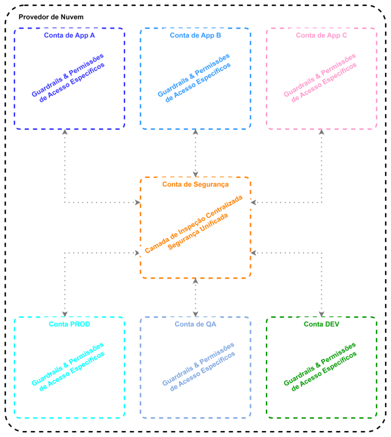
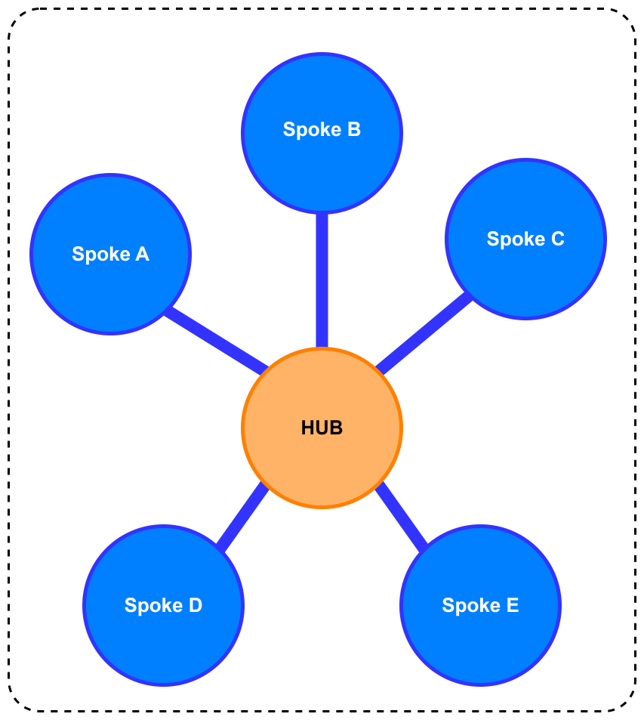
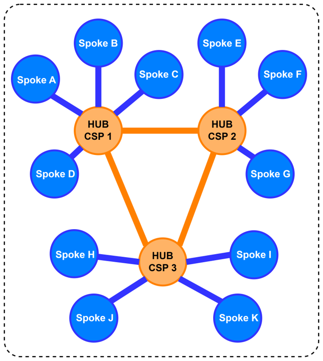

<h1 style="text-align:center">Fortinet @ LinuxTips - Bonde Fortinet 2024</h1>

<h2>
    <table>
        <tr>
            <th></img>
            </th>
            <th><h2>&</h2></th>
            <th></img>
            </th>
        </tr>
    </table>
</h2>

<h3>
    <table>
        <tr>
            <td>Live #01</td>
            <td>Cibersegurança para todos: uma abordagem leve sobre riscos e tendências</td>
            <td><a href="https://www.youtube.com/watch?v=RrWhapTzxw0"></img></a></td>
            <td><a></img></a></td>
        </tr>
        <tr>
            <td>Live #02</td>
            <td>Apertem os cintos: Evitem turbulência de redes em Cloud</td>
            <td></img></td>
            <td><a></img></a></td>
        </tr>
        <tr>
            <td>Live #03</td>
            <td>Sobrevoando nuvens e protegendo aplicações</td>
            <td></img></td>
            <td><a></img></a></td>
        </tr>
    </table>
</h3>

Sejam bem-vindos ao conteúdo de Network Security pensado especialmente para você que participou das lives do Bonde da Fortinet no LinuxTips até aqui!!
Dentro desse repositório você pode conferir todo o laboratório de ataque e defesa que foi realizado durante a Live #02 (calma que já já liberamos o conteúdo da Live #03).

<h2>Cloud Network Security</h2>
Quando o assunto é segurança de rede em nuvem, é extremamente importante entender conceitos fundamentais de rede & roteamento, bem como camadas de segurança nativas de nuvem. Abaixo você encontra alguns deles, mas lembre-se que a live foi gravada e está disponível no link do YouTube na tabela de referêcia das lives (ali em cima).

<table>
    <tr>
        <th>AWS</th>
        <th>Azure</th>
        <th>GCP</th>
        <th>OCI</th>
        <th>Conceito</th>
    </tr>
    <tr>
        <td>VPC</td>
        <td>vNET</td>
        <td>VPC</td>
        <td>VCN</td>
        <td>Rede privada usada para criar recursos e mantê-los segmentados</td>
    </tr>
    <tr>
        <td>Subnet</td>
        <td>Subnet</td>
        <td>Subnet</td>
        <td>Subnet</td>
        <td>Segmento de rede que fica dentro das Redes Privadas</td>
    </tr>
    <tr>
        <td>VPC Peering</td>
        <td>vNET Peering</td>
        <td>VPC Peering</td>
        <td>VCN Peering</td>
        <td>Conexão entre diferentes Redes Privadas</td>
    </tr>
    <tr>
        <td>Transit Gateway</td>
        <td>Virtual WAN</td>
        <td>Network Connectivity Center</td>
        <td>Dynamic Routing Gateway</td>
        <td>Forma de interconectar várias Redes Privadas entre si.</td>
    </tr>
    <tr>
        <td>Instância EC2</td>
        <td>Máquina Virtual</td>
        <td>Compute Engine</td>
        <td>Máquina Virtual</td>
        <td>IaaS - Máquina Virtual</td>
    </tr>
    <tr>
        <td>Elastic LB</td>
        <td>Load Balancer</td>
        <td>Cloud LB</td>
        <td>Load Balancer</td>
        <td>Balanceador de Carga que direciona o tráfego às aplicações</td>
    </tr>
</table>

<h2>Landing Zone</h2>
Quando falamos de Landing Zone, basicamente estamos falando de uma definição de arquitetura que permita com que a nuvem pública seja utilizada da melhor forma possível para o que ela foi projetada. Sempre levando segurança em consideração.
Uma Landing Zone é, portanto, uma área de testes pré-definida, segura e bem arquitetada, geralmente com múltiplas contas, que serve como ponto de partida para organizações lançarem e implantarem rapidamente workloads e aplicações. Essa Landing Zone é projetada para ser escalável, modular e segura, permitindo com que os diferentes times que operam a cloud configurem recursos de acordo com as necessidades de cada um dos negócios.

Uma das características mais poderosas desse tipo de arquitetura é que as Landing Zones permitem uma grande personalização para atender aos objetivos de negócio de cada empresa. Uma vez que um modelo de configuração tenha sido criado dentro de uma Landing Zone, ele pode ser utilizado para novos serviços em nuvem. Isso acelera a implantação e garante a uniformidade das políticas de segurança.

Dentro desse conceito de Landing Zones, geralmente podemos determinar:
- O número de contas a serem criadas para isolamento adequado de recursos e dados.
- Configurações de firewall alinhadas com políticas de gerenciamento de tráfego de rede.
- Controles de acesso que atendam aos requisitos de proteção de dados.
- Arquitetura de rede para garantir o isolamento do tráfego interno em relação ao tráfego externo.
- Um modelo operacional geral para migração de dados ou futuros serviços em nuvem.

</img>

Todo esse conceito permite com que os ambientes em nuvem pública tenham/forneçam:
- Maior Controle de Segurança: 
    As Landing Zones oferecem uma base robusta para a segurança e permitem a personalização de políticas através das contas. Existem também oportunidades para incorporar serviços de gestão de identidade e acesso (IAM) nas configurações, atribuindo permissionamento apenas às pessoas que realmente deveriam acessar tais recursos.

- Isolamento de dados 
    Em Landing Zones com múltiplas contas, as equipes de nuvem podem conter potenciais ameaças de segurança dentro de uma conta sem afetar as outras. Elas também podem limitar quem tem acesso aos dados, prevenindo a exposição de informações pessoais (PII), estando em aderência à diferentes regulamentações, como a LGPD por exemplo.

- Redução da complexidade 
    As Landing Zones tornam a gestão dos workloads mais simples, já que o design é definido uma vez, sendo depois utilizado sempre que necessário de acordo com as necessidades do negócio.

- Vantagem competitiva 
    Ao simplificar processos e tornar as implantações mais diretas, você pode criar novos produtos e implantá-los de uma forma mais rápida.

<h2>Modelo de Arquitetura HUB & Spoke</h2>
Todo esse papo de Landing Zone se converte em uma arquitetura bem desenhada e implantada, mas nada disso seria realmente interessante se não usassemos um conceito por trás disso tudo. Conceito esse chamado de Hub & Spoke.

Para aqueles que estiverem acostumados com conceitos de rede tradicionais (geralmente visto em ambientes on-premises), o modelo HUB & Spoke nada mais é que uma topologia Estrela. Topologia essa que determina que um ponto central dentro do ambiente é responsável por permitir ou negar comunicação entre redes e/ou segmentos de rede distintos após realizar a inspeção de tráfego necessária. Dentro de uma arquitetura Hub & Spoke, temos um desenho muito semelhante ao que vimos na sessão anterior (<a href="#landing-zone">Landing Zones</a>). Porém, para simplificar, vamos ao desenho abaixo:

</img>

Considere o ponto central (HUB) como sendo o centralizador de toda comunicação de rede. Todo tráfego vindo de uma Spoke com destino à qualquer outra Spoke seria inspecionado. Mas não só isso, todo tráfego que entrar pelo HUB com destino à alguma aplicação ou recurso provisionado em nuvem (ingress) também teria seu fluxo sendo inspecionado principalmente pensando em ataques visando explorar alguma possível vulnerabilidade nessa aplicação. Outro ponto importante é que esse mesmo HUB pode servir também para inspecionar tráfego de saída (egress), evitando diferentes tipos de vazamento de dados, sempre de acordo com o que estiver configurado nas políticas das ferramentas de inspeção.
Outro ponto extramamente interessante é que ao utilizar uma arquitetura com base no modelo Hub & Spoke, toda a parte de conexão entre diferentes ambientes (diferentes Provedores de Cloud e/ou diferentes Regiões) podem ser facilmente conectados entre si, permitindo com que os melhores recursos de cada provedor de nuvem sejam utilizados, sem perder agilidade nem segurança. Principalmente considerando a possibilidade de utilizar um roteamento com base em aplicação, latência, jitter, dentre outras métricas para sempre ter o tráfego roteado pelo caminho em que possibilita uma melhor experiência aos usuários (SD-WAN).

</img>
